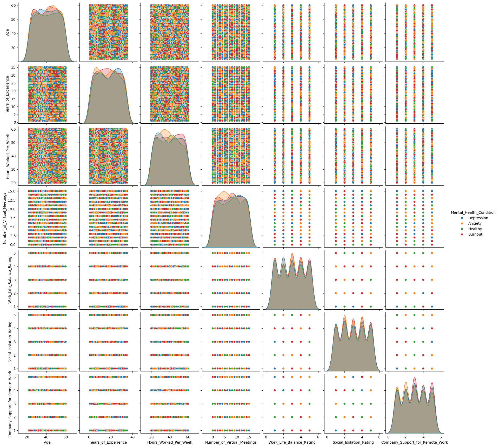
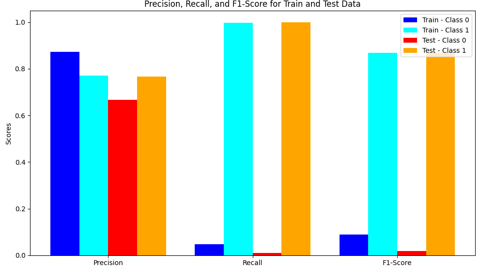

# 1. Introduction

As communication technology has improved, certain jobs that once required in-person activity can now be done remotely. As of 2024, 16% of U.S. companies only work through remote means (Haan). However, we suspect that remote work may lead to increased feelings of isolation and blur the distinction between work and personal life, leading to increased work hours, decreased physical activities, and could potentially lead to mental health disorders. To help both ourselves and others navigate this increasingly remote-work world, we aim to build a model that predicts work and life quality ratings such as stress level and mental health conditions from highly correlated predictors such as remote status, number of virtual meetings per week, physical activity, and social isolation.

The dataset used for training the model collects demographic and work-related details such as age, job roles, company location arrangements, and mental health factors such as self-reported mental health conditions, work-life balance, and stress levels across 5000 individuals. Our model will use classification techniques to classify individuals who may be experiencing mental health disorders from their work arrangements.

# 2. A complete submission including all prior submissions

Below is the README of all our past milestone submissions. Our formal report is in section 4 as described on Canvas.

## How will you preprocess your data?

First, we will need to replace null values for the feature Mental_Health_Condition and Physical_Activity with actual values.

For the null values in Mental_Health_Condition, we will label null values as "Healthy" as a null value here indicates healthy mental health.

For the null values in Physical_Activity, we will label null values as "No Exercise" as a null value here indicates no physical activity.

We won’t be scaling our dataset because the number of observations for each category in “Mental_Health_Condition” is evenly distributed. We believe the dataset is already balanced in terms of the output labels.

For the non numerical ordinal columns (stress_level, sleep_quality, and physical_activity), we will encode them in the range of 1 to 3.

We will drop the employee_id column as it is irrelevant to the target column “Mental_Health_Condition”.

For the nominal categories that are not binary (Gender, Job_Role, Industry, Work_Location, Productivity_Change, Region), we will be doing one-hot encoding.

Jupyter notebook google colab link: https://colab.research.google.com/drive/1iie7QJZn2lgUzOD9kKXeIcS07fiX64wC?usp=sharing
Jupyter notebook file locally is called milestone2.ipynb

## MILESTONE 3 ADDITIONS BELOW

One additional preprocessing step that we added was consolidating people with mental health conditions into one group and "healthy" people in one group to simplify our classification task.

### Steps 1, 2, and 3 are on the jupyter notebook local file milestone3.ipynb

## 3: Evaluate your model and compare training vs. test error
We found our test accuracy to be 0.766, while our training accuracy was 0.762, slightly better but about the same. A full classification report was printed out for both training and test metrics in the ipynb notebook.

## 4: Where does your model fit in the fitting graph? and What are the next models you are thinking of and why?
Our model fits on the very left side, as evident by the fact that our test and training accuracy are essentially equal. This indicates our model is underfitting. We are thinking of tying out a logistic regression and naive bayes because our recall is 0

## 5:
Our jupyter notebook is on this repo locally as milestone3.ipynb but we also have a Google colab set up for it: https://colab.research.google.com/drive/16FCSKdOQAi7UqrjR4zN4H9yZvxkhOWjW?usp=sharing

## 6 Conclusion section: What is the conclusion of your 1st model? What can be done to possibly improve it?
The conclusion of our 1st model is that it seems to always be predicting "unhealthy." This might be due to highly overlapping features between the two classes. One possible solution to this phenomenon is to increase the C (regularization) value to penalize the model when it guesses wrong. We hope that this encourages the model to predict healthy in more cases. We want to try oversampling as well since our data set is quite unbalanced, and SVMs do not like unbalanced data.

__Note:__
We find that accuracy metrics point toward the fact that our model simply predicts all observations as "unhealthy". For example, when we run our classification report on a binary target value (healthy or unhealthy), precision and recall are 0 for predicting healthy and (.750, 1.0) for predicting unhealthy. Our accuracy is also 0.75 for our test data. We are fully convinced that our data set was created artificially, and contains no actual correlation between any features. We expressed this concern in a piazza post during our milestone 2 submission, and responses from instructors gave us the go ahead to keep the data set. The TA told us to drop features we were uncomfortable with but it appears that all the features are random.

## Milestone 3 additions based on Gradescope feedback:

As per the feedback, we decided to check model results using a linear kernal and trying out different C regularization values. We picked the model with the highest accuracy, which was using a linear kernel and C value of 1.0. We also oversampled our data using SMOTE. As per the feedback, we also performed coefficient analysis on this model we selected by printing out every coefficient along with the feature name. A list of all coefficients can be found in the notebook under the header "Milestone 3 using linear kernal and finding the optimal regularization term (based on Gradescope feedback). Also oversampling and coefficient analysis."

We also looked at our data's correlation matrix through a seaborn heatmap, as seen here:


According to the heatmap above, most of the columns are not correlated at all. The squares of heat in our heatmap are the one-hot-encoded columns that correspond to the same feature. The heatmap contains all of the same heat with some noise, furthering our belief that our dataset was generated synthetically and randomly.

Our milestone4.ipynb notebook also tries to replicate the process that the original dataset author might have used. We find that if we randomly generate a dataset, and assign features to observations uniformly at random, we obtain a dataset similar to the one that we have been investigating. Namely, we get a very similar number of contradictory observations, and a similar distribution of all feature value occurrences.

milestone4.ipynb google colab link for easy access: https://colab.research.google.com/drive/1auR0nPVbMbBUuum9VPBjQTmcdvwHZDLW?usp=sharing

## Milestone 4 :

1.

We decided for our 2nd model to use a random forest classifier.

We ran GridSearchCV from sklearn to learn the optimal parameters to use in our model to avoid overfitting. This method yielded the following parameters:
Best Parameters:
{'max_features': None,
'min_samples_leaf': 15,
'n_estimators': 100}

However, we found that setting n_estimators = 10 instead of 100 yields better model performance, as indicated by the fact that true negatives now appear. Perhaps due to the fact that a higher n_estimators value can lead to overfitting.

2.

Our model yielded a training accuracy of 0.7710, while our test accuracy 0.7667. Additionally, our model now yields a non-zero recall for the negative classes, indicating that our model is not naively predicting true each time. Our recall on our model for the positive class is very high, sitting at 0.999, meaning it successfully predicts almost all instances of positive classes as positive. We also performed coefficient analysis on our model, and found that the top 5 features were Age, Hours_Worked_Per_Week, Years_of_Experience, Number_of_Virtual_Meetings, and Social_Isolation_Rating.

3.

Our model lies in the "ideal range" of the fitting graph because we do not have substantial overfitting, as evidenced by our training and testing accuracies differing. Furthermore, if we were to increase the complexity of our dataset, we find that we experience overfitting (n_estimates=100 causes overfitting).

4.

Our code for milestone 4 is in the local file milestone4.ipynb, but it is also available on Google colab through the link https://colab.research.google.com/drive/1auR0nPVbMbBUuum9VPBjQTmcdvwHZDLW?usp=sharing.

5.

We conclude that this second model, using a random forest classifier, performs better than our previous SVM model and performs better than random. We are now able to successfully classify some negatives, as opposed to just predicting positive for everything like our previous model did. We also get a higher accuracy on the test set with our second model compared to our first model. We could further improve our model by balancing the data more, as well as dropping features to reduce noise.

Model 1 methods:

Using a SVM tries to create a decision boundary of our data, however this did not work well for us since there is a lot of overlap in our data.

Model 2 methods:

Using a random forest classifier, similar to a decision tree in class, gave us better results since it does not depend on a decision boundary and therefore works better on highly overlapping data.

6.

We have printed an example of a true positive, true negative, false positive, and false negative at the bottom of our milestone4.ipynb file.

# 3. All code uploaded in the form of jupyter notebooks that can be easily followed along to your GitHub Repository. 

Our code for all milestones can be found locally in `milestone4.ipynb` or by accessing the Google Colab: https://colab.research.google.com/drive/1auR0nPVbMbBUuum9VPBjQTmcdvwHZDLW

# 4. Formal writeup

# Introduction to Project

As communication technology has improved, certain jobs that once required in-person activity can now be done remotely. As of 2024, 16% of U.S. companies only work through remote means (Haan). However, we suspect that remote work may lead to increased feelings of isolation and blur the distinction between work and personal life, leading to increased work hours, decreased physical activities, and could potentially lead to mental health disorders. To help both ourselves and others navigate this increasingly remote-work world, we aim to build a model that predicts work and life quality ratings such as stress level and mental health conditions from highly correlated predictors such as remote status, number of virtual meetings per week, physical activity, and social isolation.

The dataset used for training the model collects demographic and work-related details such as age, job roles, company location arrangements, and mental health factors such as self-reported mental health conditions, work-life balance, and stress levels across 5000 individuals. Our model will use classification techniques to classify individuals who may be experiencing mental health disorders from their work arrangements.

Dataset Citation

- Waqi786. (2023). *Remote Work and Mental Health* [Data set]. Kaggle. [Link](https://www.kaggle.com/datasets/waqi786/remote-work-and-mental-health)

Remote Work Statistics

- Haan, K. (2024, July 18). *Remote work statistics and trends in 2024.* Forbes. [Link](https://www.forbes.com/advisor/business/remote-work-statistics/)

 Mental Health Statistics

- The Zebra (Ed.). (n.d.). *Mental health statistics.* The Zebra. [Link](https://www.thezebra.com/resources/research/mental-health-statistics/)

---

# Methods Section

## Data Exploration

Our dataset contains 5000 observations on remote work and reported mental health disorders. The features of the dataset include:

| Column                             | Non-Null Count | Data Type |
|------------------------------------|----------------|-----------|
| Employee_ID                        | 5000 non-null   | object    |
| Age                                | 5000 non-null   | int64     |
| Gender                             | 5000 non-null   | object    |
| Job_Role                           | 5000 non-null   | object    |
| Industry                           | 5000 non-null   | object    |
| Years_of_Experience                | 5000 non-null   | int64     |
| Work_Location                      | 5000 non-null   | object    |
| Hours_Worked_Per_Week              | 5000 non-null   | int64     |
| Number_of_Virtual_Meetings         | 5000 non-null   | int64     |
| Work_Life_Balance_Rating           | 5000 non-null   | int64     |
| Stress_Level                       | 5000 non-null   | object    |
| Mental_Health_Condition            | 3804 non-null   | object    |
| Access_to_Mental_Health_Resources  | 5000 non-null   | object    |
| Productivity_Change                | 5000 non-null   | object    |
| Social_Isolation_Rating            | 5000 non-null   | int64     |
| Satisfaction_with_Remote_Work      | 5000 non-null   | object    |
| Company_Support_for_Remote_Work    | 5000 non-null   | int64     |
| Physical_Activity                  | 3371 non-null   | object    |
| Sleep_Quality                      | 5000 non-null   | object    |
| Region                             | 5000 non-null   | object    |

The target column we are trying to predict is **Mental_Health_Condition** – specifically whether a mental health condition is present (`1`) or not (`0`).

### Feature Distributions


The following pairplots show the relationship between features, with colors indicating the four classes of mental health disorder.



---

## Data Preprocessing

1. **Contradictory Observations**: 
   - Rows where `Years_of_Experience > Age` were removed.
2. **Handling Null Values**:
   - `Mental_Health_Condition`: Null values were labeled as "Healthy."
   - `Physical_Activity`: Null values were labeled as "No Exercise."
3. **Encoding Target Variable**:
   - Unhealthy mental conditions (`Anxiety`, `Burnout`, `Depression`) were encoded as `1`.
   - No mental health condition was encoded as `0`.
4. **Train-Test Split**:
   - Data was split into training and testing subsets in an 80:20 ratio.
5. **Feature Classification**:
   - Numeric and categorical features were separated.
   - Categorical features were further divided into ordinal and nominal features.
6. **Preprocessing**:
   - Numeric features were standardized.
   - Ordinal features were encoded into integers maintaining the relationship between categories.
     - Example: `data['Sleep_Quality'] = data['Sleep_Quality'].map({'Poor': 0, 'Average': 1, 'Good': 2})`
   - Nominal features were one-hot encoded.

---

# Model 1: Support Vector Machine (SVM)

Our first model was a Support Vector Machine (SVM) using an RBF kernel trained on non-oversampled data. After feedback, we created another SVM using a linear kernel and oversampled data. Various `C` regularization values were tested, and the best kernel parameter was chosen for the final SVM model.

### Parameters:

- **Kernel**: Linear  
- **Regularization**: 1.0  
- **Class Weight**: Balanced  

### Code:

```python
from imblearn.over_sampling import SMOTE
from sklearn.svm import SVC
from sklearn.metrics import classification_report

# Oversample training data
X_train_resampled, y_train_resampled = SMOTE().fit_resample(X_train, y_train)

# Test different kernels and regularization parameters
for kernel in ['linear', 'rbf']:
    for C in [0.001, 1, 2]:
        svm = SVC(kernel=kernel, C=C, class_weight='balanced')
        svm.fit(X_train_resampled, y_train_resampled)
        yhat_test = svm.predict(X_test)
        yhat_train = svm.predict(X_train)
        print("Classification report for test data:")
        print(classification_report(y_test, yhat_test, digits=3, zero_division=0.0))
        print("Classification report for train data:")
        print(classification_report(y_train, yhat_train, digits=3, zero_division=0.0))
        if kernel == 'linear':
            print("Coefficients:", svm.coef_)
```

```python
# The highest accuracy model was when we used a linear kernel and a C value of 1. We also oversampled our data.
svm = SVC(kernel='linear', C=1, class_weight='balanced')
svm.fit(X_train_resampled, y_train_resampled)
yhat_test = svm.predict(X_test)
yhat_train = svm.predict(X_train)
```

In addition to trying out different kernels for our SVM model, we performed oversampling using the SMOTE method from the imbalanced-learn Python library. This method works by synthetically creating instances of the minority class in our dataset to ensure our model does not overfit due to class imbalance. This was our group’s effort at handling the imbalance of our dataset, where 75% of the observations were instances that do have a mental health condition (positive class).

```python
from imblearn.over_sampling import SMOTE
X_train_resampled, y_train_resampled = SMOTE().fit_resample(X_train, y_train)
```

# Model 2

The second model we chose is a Random Forest Classifier. 

The reason for choosing the Random Forest Classifier for our second model is because of its flexibility and ability to average out noise and be resistant to overfitting. From our previous data exploration and SVM model, we realized that we may have highly overlapping classes and thus lack of a clear margin of separation for SVMs to perform well. Random Forest Classifiers also automatically provide feature importance, allowing us insights into our dataset.

Parameters

- max_features=None
- min_samples_leaf=15
- n_estimators=10
- random_state=42

### Model code

```python
rf = RandomForestClassifier(max_features=None, min_samples_leaf=15, n_estimators=10, random_state=42)

rf.fit(X_train, y_train)
yhat_test = rf.predict(X_test)
yhat_train = rf.predict(X_train)
print("Training accuracy: ", accuracy_score(y_train, yhat_train))
print("Testing accuracy: ", accuracy_score(y_test, yhat_test))
print(classification_report(y_test, yhat_test, digits=3))

```
Code for finding the best parameters via grid search
```python

rf = RandomForestClassifier(random_state=42)

param_grid = {
    'n_estimators': [10, 50, 100],
    'min_samples_leaf': [15, 20, 25],
    'max_features': [None, 'sqrt', 'log2']
}

grid_search = GridSearchCV(estimator=rf, param_grid=param_grid,
                           cv=5, scoring='accuracy', n_jobs=-1)
grid_search.fit(X_train, y_train)

print("Best Parameters:", grid_search.best_params_)
```

Output:

```
Best Parameters: {'max_features': None, 'min_samples_leaf': 15, 'n_estimators': 100}
```

# Results Section

## Model 1

### Trainining Data 
| Class | Precision | Recall | F1-Score | Support |
 |-------|-----------|--------|----------|---------|
 | 0 | 0.000 | 0.000 | 0.000 | 883 |
 | 1 | 0.762 | 1.000 | 0.865 | 2520 |
 | **Accuracy** | | | | **0.762** |
 | **Macro Avg** | 0.381 | 0.500 | 0.432 | 3703 |
 | **Weighted Avg** | 0.580 | 0.762 | 0.658 | 3703 |


### Test data
| Class | Precision | Recall | F1-Score | Support |
|-------|-----------|--------|----------|---------|
| 0 | 0.000 | 0.000 | 0.000 | 217 | 
| 1 | 0.765 | 1.000 | 0.867 | 709 | 
| **Accuracy** | | | | **0.765** |
 | **Macro Avg** | 0.383 | 0.500 | 0.434 | 926 |
 | **Weighted Avg** | 0.586 | 0.765 | 0.658 | 926 |


## Model 2

### Training Data
| Class | Precision | Recall | F1-Score | Support |
|-------|-----------|--------|----------|---------|
| 0 | 0.872 | 0.046 | 0.088 | 883 | 
| 1 | 0.770 | 0.999 | 0.870 | 2520 | 
| **Accuracy** | | | | **0.771** | 
| **Macro Avg** | 0.821 | 0.522 | 0.479 | 3703 | 
| **Weighted Avg** | 0.794 | 0.771 | 0.688 | 3703 |

### Testing data
## Testing Data 
| Class | Precision | Recall | F1-Score | Support | 
|-------|-----------|--------|----------|---------| 
| 0 | 0.667 | 0.046 | 0.086 | 217 | | 1 | 0.767 | 0.999 | 0.867 | 709 | 
| **Accuracy** | | | | **0.767** | 
| **Macro Avg** | 0.717 | 0.504 | 0.477 | 926 | 
| **Weighted Avg** | 0.744 | 0.767 | 0.669 | 926 |




Random forest classifier feature importance:

```python
importances = rf.feature_importances_
sorted_indices = np.argsort(importances)[::-1]
for idx in sorted_indices:
    print(X_train.columns[idx])
```

Output (truncated to top 10)

```
Age
Hours_Worked_Per_Week
Years_of_Experience
Number_of_Virtual_Meetings
Social_Isolation_Rating
Company_Support_for_Remote_Work
Work_Life_Balance_Rating
Sleep_Quality
Job_Role_Marketing
Physical_Activity
```

Diagram of first estimator (tree)


# Discussion Section

## Data Exploration

In the frequency bar charts listed in the Methods section above, our dataset seems quite balanced across all features. Although this may seem improbable with normal survey results, there is a possibility that the dataset was intentionally balanced (i.e. via oversampling) previously.

As per the pair plots presented in the Methods section, there does not seem to be a clear trend between any two features in the dataset. The colored points, at least at first glance, appear to be randomly scattered across each plot. Furthermore, the data contains every combination of possible feature values, evidenced by the scatterplots all resembling a rectangular shape.

## Data Preprocessing

We performed numerous data preprocessing steps as described in the methods section to standardize our numerical feature data, remove obvious fake observations where features were contradictory, and oversample the imbalanced data.

Performing SMOTE oversampling on our data as a preprocessing step did appear to allow us to predict negative class instances finally, as with a c value of 0.001 we had a non-zero recall for the negative class. However, it had a considerably lower accuracy than a model with a c value of 1, so we chose this model instead, despite it having a recall of 0 for the negative class instances. If we were to redo our SVM models, our group could explore models with a c value of 0.001 more since it did successfully predict some negative classes.

From our second model, Random Forest Classifier, we were given a list of features sorted by importance as determined by the model. This is something we could use in the future to further preprocess our data. We could drop columns that correspond to features that are deemed least important, removing possible noise from our model.

## Model 1

Model 1

The first model, SVM with the linear kernel, performed very well achieving high accuracy, precision and recall on Class 1(Positive mental health condition). On the other hand, the performance on Class 0(Negative mental health condition), was relatively poor with low accuracy, precision and recall. From the prediction results on both training and testing dataset, we could observe that our model generally predicted class 1, while there are only a few cases predicted as Class 0.

While we chose SVM because it has relatively higher accuracy than other models we had tried, the model failed to capture relationships between features and the negative mental health condition. We suspect that there can be two explanations. First, our dataset was severely imbalanced even after oversampling. Since SVM with linear kernel does not perform well on an imbalance dataset, the model prioritized positive mental health condition over negative, as seen in the significantly better performance for positive condition. Secondly, the linear kernel assumes that the data is linearly separable. If our data distribution is not linearly separable, the model will struggle to classify particularly for minority classes.

Assuming our suspicion that our dataset is synthetic is correct, the values for each feature are randomly generated. When we examine the distribution of the dataset, it is normally distributed, but when the model tries to find relationships between features and the target, it will struggle to separate the dataset linearly.

In the SVM model, after having done SMOTE oversampling, we separately fitted a model on just the features “Hours_Worked_Per_Week”, and “Age” to be able to visualize a decision boundary (Repurposing code from the Week 6 discussion notebook). We chose these features because we thought there should be some amount of visible correlation between these and mental health, but the results obtained from doing this (using both linear and rbf kernels, and different values of C) were all still random for the test data.


## Model 2

We chose to use the Random Forest Classifier after SVM because we suspected that our data had highly overlapping classes and thus was making it hard for SVMs to accurately classify due to the lack of a clear margin of separation. Since Random Forest classifiers are more flexible and can handle both linear and nonlinear relationships well, we decided to experiment the dataset with Random Forest Classifiers. 

From the results, the previous problem encountered with the model not predicting Class 0 appears to be slightly alleviated, with the precision and recall score for Class 0 no longer zero for Random Forest classifier. 

Furthermore, the importance of features that the model outputted may be a good reference for later on, if we want to reduce noise and truncate our dataset to contain only relevant features. It is worth noting that the top ten most important features mostly includes numeric and ordinal categorical columns, indicating that they may contain the most information (compared to one-hot encoded nominal features) and may be the most relevant to the output label.

# Conclusion

**On the Validity of our Dataset:**
As we began visualizing our data, we noticed that it was quite difficult to observe correlations between features. This led us to believe one of the following:
- **Our dataset might be very well balanced, due to extensive and precise sampling.**
We noticed that for all features, the data seemed to be balanced nearly perfectly across all possible values. For example, the distribution of people who identified as “Male,” “Female,” “Non-Binary,” and “”Prefer Not To Say,” was near even. This was surprising given less than 1% of Americans identify themselves as Non-Binary, according to the Williams Institute at UCLA. This could have been due to the creators of the data set having sampled people with regard to gender, in order to avoid possible bias. However, we noticed this similar “even distribution” trend across all features, including what continent the person was from. This led us to suspect the next possibility:
- **Our data set is fake.**
We provide evidence in our Colab Notebook, in the section titled: Proof our dataset was randomly generated. In summary, we became confident that our data set was artificially created with values for features generated uniformly at random. We performed a quick investigation by creating our own data set in the way that we believed our project data set was created. We then found that the number of occurrences of a particular contradiction in an observation, namely, age < years of experience, was within a margin of error of the real data set. Furthermore, after constructing a heatmap of correlation between features, we found that our entire graph was uniformly “room temperature.” For example, there was no correlation between age and years of experience, even though we would expect there to be some vaguely constant relationship. 

**On the Performance of our Models:**

Given our belief that our dataset is randomly generated with a uniform distribution, there is no correlation between any of our features, and thus we would expect that there is no possible model that could draw useful conclusions. However, we were able to overcome the issue that occurred with simpler models. This issue was that our model would simply predict “healthy” for all observations, with no regard to the features. This led to a model that was no better than random. However, our second model was in fact able to predict at a rate slightly better than random. This was evidenced by the fact that our model did *not* only predict “healthy,” and was able draw conclusions by actually looking at the feature values. We believe that this was due to our model’s complexity, and we also concluded that we did not suffer from overfitting, since we did not have a worse performance on our test data set.

**Final Thoughts:**

Although we were disappointed in the accuracy of our models, we gained valuable insight into how the models worked, into how the model should be used, and into the process of data investigation itself. 

By building our models, and investigating quirky scores and charts, we learned how models behave given dubious data. For example, an SVM attempts to maximize the margin between the decision boundary and the data points. However, if the data points overlap completely (as they did) the SVM process fails to provide any usable results. However, a Random Forest Classifier, which generates a number of decision trees, does not face the exact same issue. Instead, they suffer when the data has high entropy along any split (as our data did). These investigations into our model’s underperformance strengthened our understanding of these topics discussed in class. We more deeply understood the margin-maximization performed by SVMs, and the entropy-reducing/information-gain splitting performed by decision trees.

As we asked ourselves: “What model should we use next”, or “What can we do differently to stop guessing at random,” we explored a vast array of techniques, including different models, parameters to models, and types of feature scaling/encoding. For example, we decided to perform oversampling on our SVC model in order to attempt to prevent it from always predicting “healthy.” This did in fact work, demonstrating our understanding of the tendencies of SVCs, and the purpose and effectiveness of oversampling. 

Lastly, as we gathered evidence that our data set was fake, we learned key data analysis techniques. Comparing features against other features where we expect to have a correlation, such as “Access To Mental Health Resources” and “Mental Health Condition” gave us valuable experience in forming hypotheses and testing them. Creating charts to show the lack of correlation between any features, like our heatmap, gave us data visualization, and analysis skills. 

In conclusion, we value our experience with this project, despite the frustration with being stuck with a “bogus” data set. We were able to reinforce our understanding of class topics by experimenting with various models and techniques, and we learned about new topics while performing external research. We believe that in the future, we will have more success with training models on datasets, perhaps by first selecting our dataset more carefully.

# Statement of Collaboration

## Name: Ekin Celik, Title: Group Member

Contributions

- Participated in meetings, including proposals, and design
- Provided model analysis for milestones
- Explored validity of data set
- Wrote Conclusion Section

## Name: Kelly Yen, Title: Group Member

Contributions

- Proposed current dataset and possible project ideas
- Proposed second model and did hyperparameter tuning
- Wrote method and discussion section for preprocessing and second model
- Participated in group discussions about new methods, models, and reasonings for model performance

## Name: Christopher Schrader, Title: Project Manager

Contributions

- Streamed live project coding to group at milestone meetings, where each individual contributed to the live coding sessions.
- Performed oversampling in copy of milestone code and presented to group
- Proposed numerous datasets
- Wrote part of the methods section and wrote for the discussion section on writeup.

## Name: Tyler Le, Title: Group Member

Contributions
- Participated in meetings and discussions about project structure and where to go next
- Assisted with development and debugging when it was being live shared
- Contributed to the preprocessing steps used for model training
 
## Name: Andrew Tan, Title: Group Member

Contributions

- Helped with data visualization
- Created a simple simulation parallel to some features in the dataset 
- Checked certain value proportions present in the dataset against real-world data 
- Minor suggestions for first model and contribution to write up

## Name: Chanho Jeon, Title: Group Member

Contributions

- Data Visualization of results on both models
- Wrote result section
- Wrote discussion(model 1)

All work was done in group meetings where everyone was present and contributed. At the start of the project, every member collected datasets and presented an idea for a project. During model training and evaluation, we collectively analyzed model performance and proposed potential solutions to improve on our implementations.

